# Bàn Cờ Quyền Lực & Quả Bom Tham Nhũng

Web app trò chơi cho lớp **Chủ nghĩa xã hội khoa học** (~60 sinh viên, 7 nhóm, ~30 phút trên lớp). Chủ đề: nhà nước, nhà nước XHCN, đặc điểm nhà nước pháp quyền XHCN Việt Nam.

> **▶ Chơi ngay trên web (không cần cài gì): https://cnxh-game.onrender.com/** — xem [cách dùng bản web](#cách-1--dùng-bản-web-trên-render-không-cần-cài-gì).

Hai trò chơi nối tiếp nhau trên **cùng một bàn cờ lục giác**:
1. **Bàn Cờ Quyền Lực**: các nhóm biểu quyết chọn ô, trả lời câu hỏi và chiếm lãnh thổ.
2. **Quả Bom Tham Nhũng**: nhóm cầm bom trả lời đúng thì được chuyền bom đi; bom nổ ở nhóm nào thì nhóm đó mất ô.

<p align="center">
  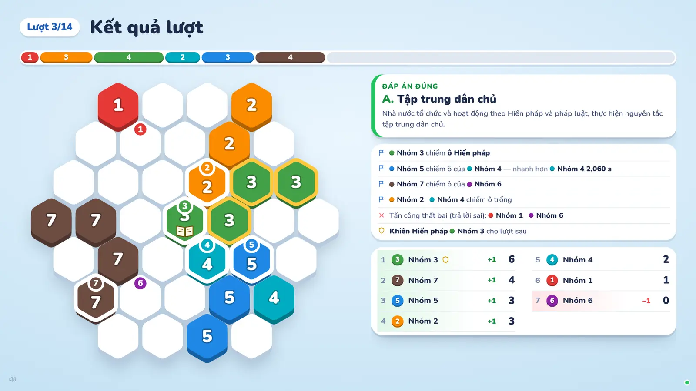
  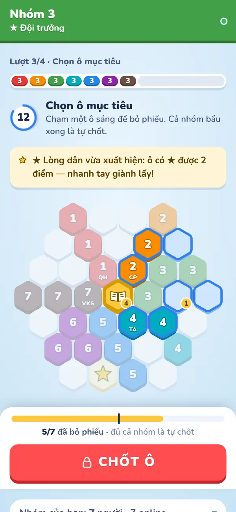
</p>
<p align="center"><sub>Màn chiếu (trái) và điện thoại của một sinh viên (phải). Mọi hình trong file này là ảnh chụp app thật, trong một trận chơi thử với người chơi giả lập (chụp lại bằng <code>npm run screenshots</code>, xem <a href="#chụp-lại-ảnh-readme-npm-run-screenshots">mục 6</a>). Xem đủ từng màn hình ở <a href="#3-luật-chơi-và-cách-chơi">mục 3</a>.</sub></p>

| Màn hình | Ai dùng | Thiết bị |
|---|---|---|
| `/host` | Cả lớp nhìn | Máy chiếu 16:9 (QR, bàn cờ, câu hỏi, bảng điểm) |
| `/play` | Sinh viên | Điện thoại, trình duyệt, không cần cài app (quét QR) |
| `/admin` | Người dẫn | Laptop, cần mật khẩu `ADMIN_PASSWORD` |

> **Đọc file này trước.** Luật chi tiết nằm ở [docs/GAME_SPEC.md](docs/GAME_SPEC.md). Đó là **nguồn sự thật về luật**: code và spec mà lệch nhau thì spec đúng.

---

## Mục lục
1. [Bắt đầu: dùng bản web hoặc chạy trên máy](#1-bắt-đầu-dùng-bản-web-hoặc-chạy-trên-máy)
2. [Cách tổ chức một buổi chơi](#2-cách-tổ-chức-một-buổi-chơi)
3. [Luật chơi và cách chơi](#3-luật-chơi-và-cách-chơi) (có hình từng màn hình)
4. [Kiến trúc](#4-kiến-trúc)
5. [Bản đồ codebase](#5-bản-đồ-codebase)
6. [Hướng dẫn sửa đổi thường gặp](#6-hướng-dẫn-sửa-đổi-thường-gặp)
7. [Test](#7-test)
8. [Deploy](#8-deploy)
9. [Quy ước làm việc và Claude Code](#9-quy-ước-làm-việc-và-claude-code)
10. [Việc còn dở và vấn đề đã biết](#10-việc-còn-dở-và-vấn-đề-đã-biết)
11. [Xử lý sự cố](#11-xử-lý-sự-cố)

---

## 1. Bắt đầu: dùng bản web hoặc chạy trên máy

Có hai cách dùng. **Đồng đội chỉ cần tổ chức buổi chơi thì dùng Cách 1** (bản web đã deploy, không cần cài gì). Cách 2 dành cho người sửa code hoặc khi cần chạy không có Internet.

### Cách 1 — Dùng bản web trên Render (không cần cài gì)

| Mở trang | Ai dùng | Ghi chú |
|---|---|---|
| https://cnxh-game.onrender.com/ | Mọi người | Trang chủ: 3 nút Màn chiếu / Người chơi / Người dẫn |
| https://cnxh-game.onrender.com/host | Máy chiếu | QR, bàn cờ, câu hỏi, bảng điểm. Điều khiển bằng phím được (bấm `K`, xem [mục 2](#2-cách-tổ-chức-một-buổi-chơi)) |
| https://cnxh-game.onrender.com/admin | Người dẫn | Cần **mật khẩu admin** — hỏi người quản lý bản deploy (đặt ở biến `ADMIN_PASSWORD` trên Render; không ghi vào README vì repo công khai) |
| https://cnxh-game.onrender.com/play | Sinh viên | Thường không cần gõ: quét QR trên màn chiếu là vào thẳng phòng |

**Một buổi học với bản web:**
1. **Khoảng 15 phút trước giờ học**, mở `/host` trên máy tính nối máy chiếu và để nguyên tab. Gói miễn phí của Render "ngủ" sau ~15 phút không ai dùng; lần mở đầu mất 30–60 giây để thức dậy.
2. Trên laptop (hoặc điện thoại) của người dẫn, mở `/admin`, nhập mật khẩu, bấm **Tạo phòng**. Màn chiếu tự hiện mã QR và mã phòng 4 chữ số.
3. Sinh viên quét QR, nhập tên, chọn nhóm. Người dẫn bấm **Đặt theo danh sách** để chọn nhóm trưởng thực tế làm đội trưởng (nếu đã nhập danh sách — xem [mục 2](#2-cách-tổ-chức-một-buổi-chơi)).
4. Từ đó chỉ cần bấm nút xanh **Bước tiếp theo** (hoặc phím `Space` trên màn chiếu) theo [kịch bản 30 phút](#2-cách-tổ-chức-một-buổi-chơi).

**Chơi thử trước buổi học:** mở `/admin` tạo phòng, rồi mở vài **tab ẩn danh** `https://cnxh-game.onrender.com/play?room=XXXX` (mỗi tab là một người chơi), hoặc nhờ vài bạn dùng điện thoại.

**Lưu ý khi dùng bản web:**
- Bản web tự cập nhật mỗi khi có code mới được merge vào nhánh `main` (Render tự deploy lại, mất vài phút). **Hôm học đừng merge/push gì lên `main`**, vì server khởi động lại thì trận đang chơi bị mất.
- Gói miễn phí không giữ được trận nếu server khởi động lại giữa chừng; khi đó bấm **Tạo phòng mới** và chơi tiếp từ đầu (hoặc dùng [chế độ dự phòng](#2-cách-tổ-chức-một-buổi-chơi) nếu mất mạng).
- Điện thoại dùng Chrome hoặc Safari bản mới. Mất mạng hay khóa màn hình thì mở lại trang là vào lại đúng nhóm.
- Người quản lý deploy (đổi mật khẩu, xem log, tắt Auto-Deploy): xem [docs/DEPLOY.md](docs/DEPLOY.md).

### Cách 2 — Chạy trên máy (thủ công)

#### Yêu cầu
- **Node.js ≥ 20** (khuyên dùng 24, đúng với [.nvmrc](.nvmrc); có `nvm` thì gõ `nvm use`)
- npm (đi kèm Node). Repo dùng **npm workspaces**, không dùng yarn/pnpm.

#### Cài và chạy
```bash
git clone https://github.com/leonardotrong/CNXH_GAME_4.git
cd CNXH_GAME_4
npm ci                                  # cài đúng phiên bản trong package-lock.json
ADMIN_PASSWORD=admin npm run dev        # server :3000 + client :5173
```
Windows (PowerShell): `$env:ADMIN_PASSWORD="admin"; npm run dev`.
Lệnh `npm start` của server dùng cú pháp biến môi trường kiểu Unix, nên trên Windows hãy dùng Git Bash hoặc WSL.

Mở trên trình duyệt:
- http://localhost:5173/admin: đăng nhập bằng `admin` rồi bấm **Tạo phòng**
- http://localhost:5173/host: hiện mã QR và mã phòng 4 chữ số
- http://localhost:5173/play?room=XXXX: mở vài **tab ẩn danh** (mỗi tab là một người chơi), nhập tên và chọn nhóm

Muốn chơi thử bằng **điện thoại thật** trong cùng wifi, hãy đặt `PUBLIC_URL` thành địa chỉ "Network" mà Vite in ra, để QR trỏ đúng chỗ:
```bash
ADMIN_PASSWORD=admin PUBLIC_URL=http://192.168.1.3:5173 npm run dev
```

Muốn xem **cả trận chạy tự động** mà không phải bấm tay: `npm run simulate -- --turns 3 --bombs 1`. Lệnh này cho 63 bot chơi trên một server riêng trong tiến trình, không dính tới server dev.

#### Tất cả các lệnh
| Lệnh | Việc |
|---|---|
| `npm run dev` | Chạy song song server (`tsx watch`, cổng 3000) và client (Vite, cổng 5173). Vite proxy `/socket.io` và `/api` sang server. |
| `npm test` | Chạy toàn bộ test một lần (Vitest). `npm run test:watch` để chạy liên tục. |
| `npm run typecheck` | Kiểm tra kiểu cả 4 project TypeScript: `shared`, `server`, `client`, `scripts` |
| `npm run build` | Chạy typecheck rồi build client ra `client/dist` |
| `npm start` | Server production (`NODE_ENV=production`), phục vụ luôn `client/dist` ở cổng `PORT` (mặc định 3000) |
| `npm run simulate` | Giả lập 63 bot chơi trọn một trận (xem [mục 7](#giả-lập-tải-npm-run-simulate)) |
| `npm run screenshots` | Chụp lại toàn bộ ảnh minh họa của README vào `docs/images/` (cần Chrome; xem [mục 6](#chụp-lại-ảnh-readme-npm-run-screenshots)) |

#### Biến môi trường
| Biến | Mặc định | Ý nghĩa |
|---|---|---|
| `ADMIN_PASSWORD` | (không có) | Mật khẩu vào `/admin`. **Không đặt thì không ai đăng nhập được.** |
| `PUBLIC_URL` | origin của trang `/host` | Địa chỉ in trong QR cho điện thoại quét |
| `STATE_FILE` | `server/data/match.json` | File lưu trạng thái trận. Đặt rỗng (`STATE_FILE=`) để tắt. |
| `PORT` | `3000` | Cổng server |

---

## 2. Cách tổ chức một buổi chơi

Kịch bản 30 phút ([GAME_SPEC §1](docs/GAME_SPEC.md#1-kịch-bản-30-phút)):

**Người dẫn chỉ cần nhớ một nút: "Bước tiếp theo"** (nút xanh lớn trên `/admin`, hoặc phím `Space` trên màn chiếu). Nút luôn ghi rõ việc sẽ xảy ra; trong pha tự chạy, nút hiện "Đang tự chạy" và không làm gì.

<p align="center">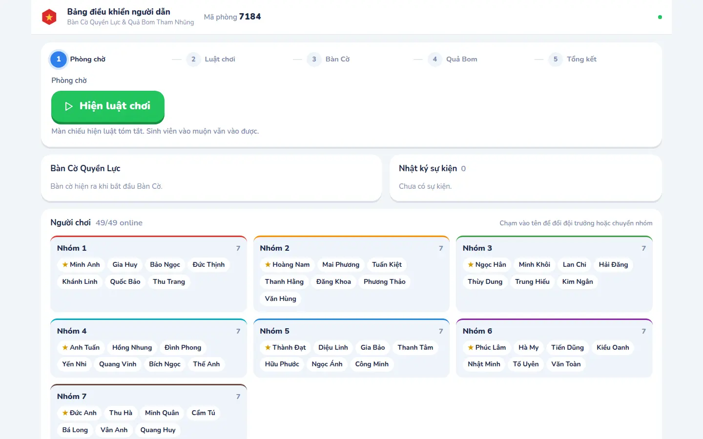</p>
<p align="center"><sub><code>/admin</code> ở phòng chờ: thanh 5 chặng, nút xanh <b>Bước tiếp theo</b> (lúc này ghi "Hiện luật chơi"), ngay dưới là thanh vàng <b>Đặt theo danh sách</b> ghi sẵn nhóm trưởng thực tế sẽ được đặt ở từng nhóm; bên dưới là người chơi theo nhóm, mỗi nhóm có ô ★ đội trưởng và dòng so với danh sách (chạm vào tên để đổi đội trưởng hoặc chuyển nhóm).</sub></p>

| Phút | Pha | Nút "Bước tiếp theo" ghi | Ghi chú |
|---|---|---|---|
| Trước giờ | | **Tạo phòng** | Mở `/host` trên máy chiếu **khoảng 15 phút trước giờ học** (gói Render miễn phí cần thời gian "thức dậy"). |
| 0–3 | LOBBY | **Hiện luật chơi** | Sinh viên quét QR, nhập tên, chọn Nhóm 1–7. Người vào nhóm đầu tiên tạm làm đội trưởng; bấm **Đặt theo danh sách** (thanh vàng ngay dưới nút) để đổi sang nhóm trưởng thực tế. "Câu thử" (ở *Công cụ khác*) giúp lớp làm quen cách bỏ phiếu. |
| 3–4 | RULES | **Bắt đầu Bàn Cờ** | Giải thích luật xong mới bấm (pha không có đồng hồ). Chỉnh số lượt ngay cạnh nút (mặc định 14). |
| 4–21 | BOARD | *Đang tự chạy* | Các lượt tự chạy. Thiếu giờ thì bấm **Kết thúc sau lượt này** ở thẻ Bàn Cờ. |
| 21–28 | BOMB | **Bắt đầu Quả Bom** | Màn giới thiệu Quả Bom (BOMB_INTRO). Chỉnh số bom ngay cạnh nút (1–5, mặc định 3). |
| 28–30 | SUMMARY | **Hiện tổng kết bài học** | Bục vinh danh, rồi 6 đặc điểm của nhà nước pháp quyền XHCN. |

<p align="center">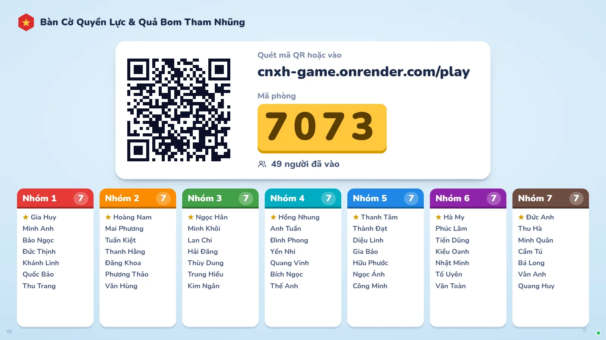</p>
<p align="center"><sub>Màn chiếu ở phòng chờ: sinh viên quét QR (hoặc gõ địa chỉ rồi nhập mã phòng 4 chữ số); tên hiện ngay trong cột nhóm vừa chọn, đội trưởng ★ đứng đầu cột.</sub></p>

**Đội trưởng theo danh sách nhóm trưởng thực tế** ([GAME_SPEC §2.1](docs/GAME_SPEC.md#21-người-chơi-nhóm-đội-trưởng)): 7 nhóm trùng nhóm của lớp nên đã có sẵn nhóm trưởng. Cách dùng:
1. **Một lần, trước buổi học:** trên `/admin`, mục *Người chơi* → **Nhập danh sách nhóm trưởng**, gõ họ tên nhóm trưởng của từng nhóm. Có thể dán cả cột từ Excel hay ghi chú vào ô Nhóm 1 (mỗi dòng một nhóm; dòng tiêu đề, "Nhóm 3:", "3." được tự bỏ). Danh sách chỉ lưu trên trình duyệt của máy đó, không gửi lên server.
2. **Trong buổi học:** khi sinh viên đã vào, thanh vàng ngay dưới nút Bước tiếp theo ghi sẵn ai sẽ được đặt (vd. "Nhóm 1 → An · Nhóm 5 → Tâm"); bấm **Đặt theo danh sách** (hoặc nút cùng tên ở mục *Người chơi*). Một lần bấm là xong cho mọi nhóm.
3. Mỗi nhóm có ô **★** để chọn tay, kèm một dòng cho biết tình trạng: *Đúng danh sách*, *người sẽ được đặt*, *trùng tên — chọn tay*, *vào nhầm nhóm* (có nút **Chuyển về & đặt ★**), hoặc *chưa thấy vào phòng*.

Tên được so không phân biệt hoa thường. Sinh viên gõ không dấu vẫn khớp; còn khi cả hai bên đều có dấu thì dấu được tính ("Hùng" khác "Hưng"). Sinh viên gõ tắt ("An", "Văn An", "Nguyễn An") vẫn khớp "Nguyễn Văn An" nếu trong nhóm chỉ có một người như vậy; tên dài bị cắt ở 20 ký tự cũng khớp. Chưa đặt thì người vào nhóm đầu tiên tạm làm đội trưởng.

**Điều khiển ngay trên máy chiếu (khỏi chuyển cửa sổ):** trên `/host` bấm `K` (hoặc nút mờ ở góc phải dưới) và nhập mật khẩu admin một lần. Sau đó: `Space`/`→` = bước tiếp theo, `P` = tạm dừng/tiếp tục, `M` = tắt/bật âm thanh, `F` = toàn màn hình. Mỗi lần bấm có thông báo xác nhận ngắn; gợi ý phím hiện mờ rồi tự ẩn. (Tạo phòng mới khi đang có trận chỉ làm được ở `/admin`, để tránh bấm nhầm.)

<p align="center">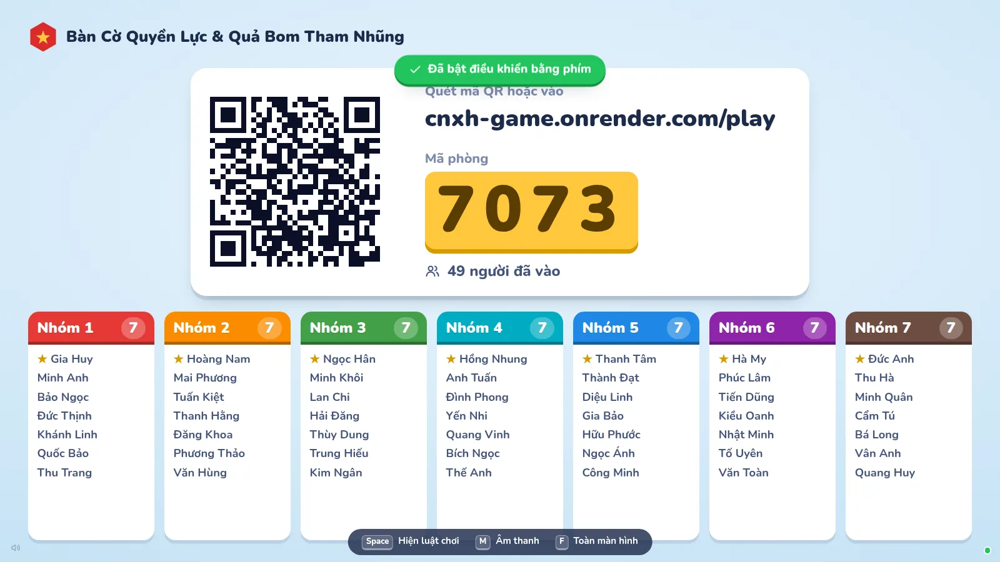</p>
<p align="center"><sub>Sau khi bấm <code>K</code> và nhập mật khẩu: thông báo "Đã bật điều khiển bằng phím" ở trên, gợi ý phím ở dưới (tự ẩn sau vài giây).</sub></p>

Các nút dùng được bất cứ lúc nào:
- **Tạm dừng / Tiếp tục** (cạnh nút Bước tiếp theo, hoặc phím `P`): mọi đồng hồ (kể cả ngòi bom) đứng yên, người chơi không bỏ phiếu được.
- **Bỏ qua câu lỗi**: đổi sang câu khác. Mục tiêu đã chọn được giữ nguyên, ngòi bom vẫn cháy tiếp.
- **Chỉnh tay**: đổi chủ ô, đổi đội trưởng (ô ★ của từng nhóm, hoặc **Đặt theo danh sách**), chuyển người chơi sang nhóm khác.
- **Nhật ký sự kiện**: ai chiếm ô nào, ai phòng thủ thành công, bom nổ ở đâu. Dùng để giải quyết tranh cãi.
- **Chế độ dự phòng** (khi mạng sập): các nhóm giơ thẻ màu A/B/C/D, người dẫn nhập ô mục tiêu, đáp án và thứ tự nhanh chậm, còn `/host` vẫn chạy. Chi tiết ở [GAME_SPEC §5.3](docs/GAME_SPEC.md#53-admin--người-dẫn-bảo-vệ-bằng-mật-khẩu-từ-biến-môi-trường-admin_password).

<table>
  <tr>
    <td width="50%">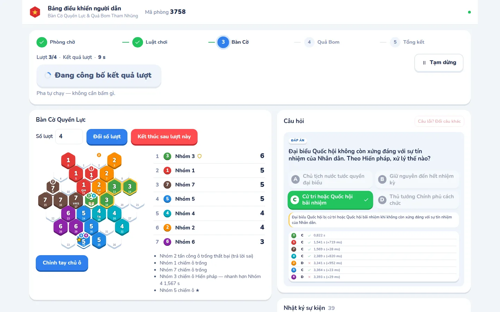</td>
    <td width="50%">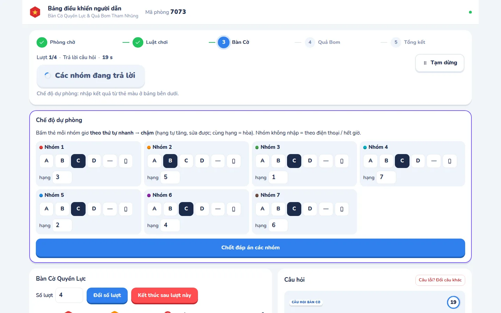</td>
  </tr>
  <tr>
    <td><sub>Trong trận: lượt, pha và đồng hồ; nút <b>Tạm dừng</b>; số lượt và <b>Kết thúc sau lượt này</b>; bàn cờ có số ô để chỉnh tay; câu hỏi của lượt (câu đóng rồi mới hiện đáp án, lựa chọn và thời gian chốt của từng nhóm) và nhật ký sự kiện.</sub></td>
    <td><sub>Chế độ dự phòng: bấm thẻ mỗi nhóm giơ theo thứ tự nhanh → chậm (hạng tự tăng, sửa được), rồi bấm <b>Chốt đáp án các nhóm</b>. Màn chiếu hiện băng-rôn "Chế độ dự phòng".</sub></td>
  </tr>
</table>

Server sập giữa trận? Khởi động lại server là trận được **khôi phục ở trạng thái tạm dừng** (nếu file lưu mới hơn 3 giờ). Người chơi tải lại trang sẽ vào lại đúng nhóm, sau đó người dẫn bấm **TIẾP TỤC**. (Trên Render gói miễn phí thì không khôi phục được, vì file lưu mất mỗi lần khởi động lại; xem [docs/DEPLOY.md](docs/DEPLOY.md#lưu-trạng-thái-trên-render).)

---

## 3. Luật chơi và cách chơi

> Bản đầy đủ, kèm mọi trường hợp biên, nằm ở [docs/GAME_SPEC.md](docs/GAME_SPEC.md). Phần dưới đây tóm tắt luật và cho xem từng màn hình theo đúng thứ tự một buổi chơi. Ảnh chụp từ một trận chơi thử; điện thoại trong ảnh là của "Ngọc Hân", đội trưởng Nhóm 3.

<p align="center">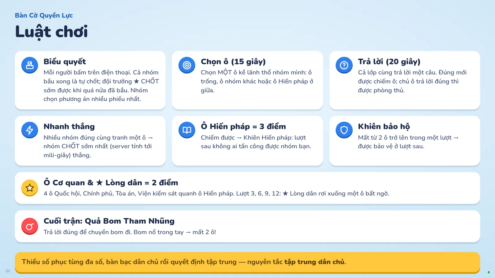</p>
<p align="center"><sub>Màn luật tóm tắt người dẫn mở trước khi chơi (pha RULES, không có đồng hồ).</sub></p>

### Vào phòng
1. Quét QR trên màn chiếu: mã phòng được điền sẵn. Nhập tên, chọn nhóm, bấm **Vào chơi**. Không cần cài app.
2. **Đội trưởng ★** là nhóm trưởng thực tế do người dẫn đặt theo danh sách (chưa đặt thì người vào nhóm đầu tiên tạm làm). Nên gõ đủ họ tên để khớp danh sách chắc chắn. Mất mạng hay tải lại trang thì tự vào lại đúng nhóm, đúng vai trò.
3. Còn ở phòng chờ thì đổi nhóm được. Người dẫn bấm **Hiện luật chơi** thì điện thoại cũng hiện luật tóm tắt.

<p align="center">
  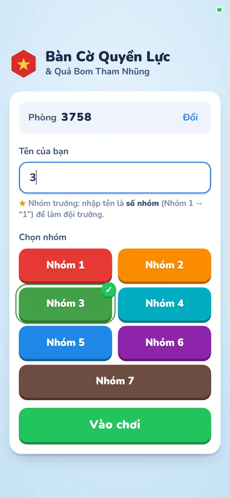
  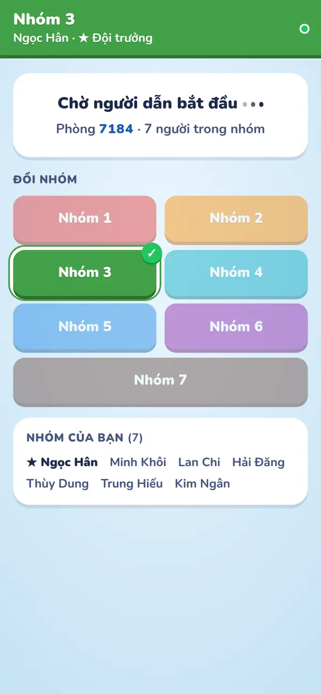
  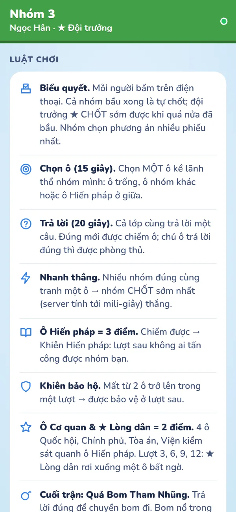
</p>

### Biểu quyết trong nhóm (dùng cho mọi lựa chọn) ([§2.2](docs/GAME_SPEC.md#22-biểu-quyết-trong-nhóm-dùng-cho-câu-hỏi-chọn-ô-chọn-nhóm-nhận-bom))
- Mỗi thành viên bỏ phiếu trên điện thoại và được đổi ý. Thành viên chỉ thấy phiếu của nhóm mình.
- **Cả nhóm bầu xong là tự chốt**: ngay khi thành viên online cuối cùng bỏ phiếu, nhóm tự chốt (thời điểm chốt = lúc server nhận phiếu đó).
- **Đội trưởng có thể CHỐT sớm hơn** khi **quá nửa** số thành viên đang online đã bỏ phiếu — chốt sớm thì dễ thắng tranh chấp.
- Lựa chọn của nhóm là phương án nhiều phiếu nhất. Hòa thì theo phiếu đội trưởng; đội trưởng chưa bỏ phiếu thì lấy phương án đạt số phiếu đó sớm nhất.
- Hết giờ mà chưa chốt: server tự chốt, và thời điểm chốt là lúc hết giờ. Không có phiếu nào thì nhóm không có lựa chọn.
- **"Nhanh hơn" = thời điểm SERVER nhận lệnh CHỐT** (tính bằng mili-giây). Khi mọi nhóm đã chốt, vòng đóng ngay.
- Đội trưởng mất kết nối quá 10 giây: quyền tạm chuyển cho thành viên online vào nhóm sớm nhất, và được trả lại khi đội trưởng quay lại.

<p align="center">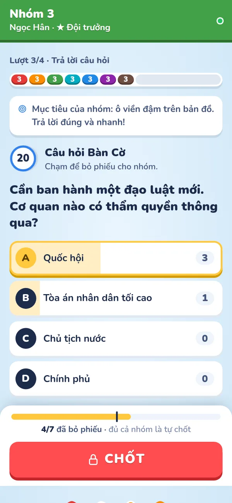</p>
<p align="center"><sub>Mỗi phương án hiện số phiếu của nhóm mình (tô màu theo tỉ lệ); thanh dưới đếm người đã bầu, vạch giữa là mốc quá nửa. Chỉ đội trưởng thấy nút <b>CHỐT</b>.</sub></p>

### Bàn Cờ Quyền Lực ([§3](docs/GAME_SPEC.md#3-bàn-cờ-quyền-lực))
- Lưới lục giác bán kính 3, tức **37 ô**. Ô giữa là **ô Hiến pháp** (tính 3 điểm). Mỗi nhóm có người được 1 ô xuất phát ở vòng ngoài.
- **Ô đặc biệt** ([§3.7](docs/GAME_SPEC.md#37-ô-cơ-quan-và--lòng-dân)), lấy cảm hứng từ ô "vương miện" của Kingdomino và ngôi sao của Mario Party:
  - **4 ô Cơ quan** quanh ô Hiến pháp: Quốc hội, Chính phủ, Tòa án, Viện kiểm sát (nhãn QH/CP/TA/VKS), mỗi ô **2 điểm**. Đặt sao cho mỗi nhóm cách đúng một ô Cơ quan 2 bước từ ô xuất phát, nên không nhóm nào lợi thế.
  - **★ Lòng dân**: đầu lượt 3, 6, 9, 12, server thả một ngôi sao xuống một ô bất ngờ (màn chiếu báo kèm âm thanh). Ô có ★ được **2 điểm** cho nhóm đang giữ ô, cướp qua cướp lại được. Sao không rơi vào ô của nhóm dẫn đầu và ưu tiên ô mà ít nhất 2 nhóm khác cùng tới được.
- Một lượt gồm 3 pha:
  - **SELECT** (15 s): chọn 1 ô mục tiêu kề lãnh thổ mình.
  - **QUESTION** (20 s): cả 7 nhóm trả lời cùng một câu trắc nghiệm.
  - **REVEAL** (10 s): giải quyết lượt và hiện đáp án kèm giải thích.
- **Giải quyết** (tính đồng thời trên trạng thái đầu lượt). Ứng viên của một ô gồm các nhóm nhắm ô đó **và trả lời đúng**, cộng thêm chủ ô nếu chủ trả lời đúng (phòng thủ). Ứng viên **chốt sớm nhất thắng**. Nếu trùng mili-giây thì ô giữ nguyên.
- **Khiên** (miễn bị tấn công trong 1 lượt) có hai loại:
  - *Khiên Hiến pháp*: vừa chiếm được ô Hiến pháp.
  - *Khiên bảo hộ*: mất ≥ 2 ô trong một lượt.
- Điểm = tổng giá trị các ô sở hữu: ô Hiến pháp 3, ô Cơ quan 2, ô có ★ 2, ô thường 1. Hòa điểm thì xét số câu đúng cả trận, rồi đến tổng thời gian chốt các câu đúng (ít hơn xếp trên).

**Một lượt qua hình ảnh** (lượt 3 của trận chơi thử: Nhóm 3 nhắm ô Hiến pháp).

**① Chọn ô — 15 giây.** Trên điện thoại, các ô nhóm được nhắm sáng viền xanh, ô khác mờ đi; số trên ô là số phiếu của nhóm mình (ở đây 4 phiếu cho ô Hiến pháp, 1 phiếu cho ô khác). Màn chiếu chỉ cho biết bao nhiêu nhóm đã chốt (✓ trong bảng điểm), **chưa lộ mục tiêu** của nhóm nào. Lượt 3 cũng là lượt ★ Lòng dân rơi xuống: màn chiếu có băng-rôn vàng, điện thoại có dòng nhắc.

<p align="center">
  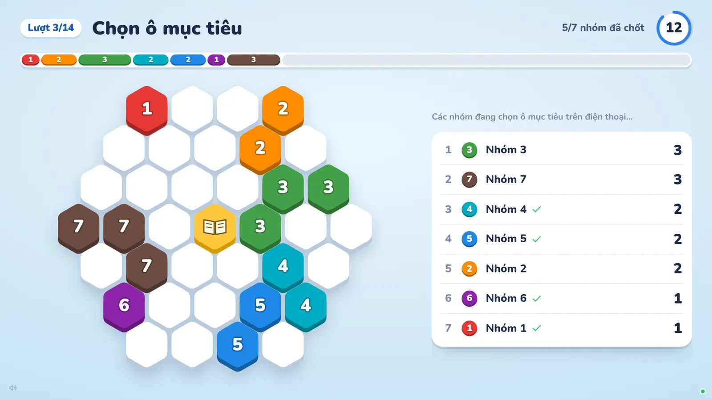
  
</p>

**② Trả lời — 20 giây.** Hết pha chọn ô, mục tiêu của mọi nhóm được lật cùng lúc (huy hiệu số nhóm trên ô). Cả 7 nhóm trả lời cùng một câu; màn chiếu hiện nhóm nào đã chốt và sau bao nhiêu giây, nhưng không lộ nhóm chọn gì.

<p align="center">
  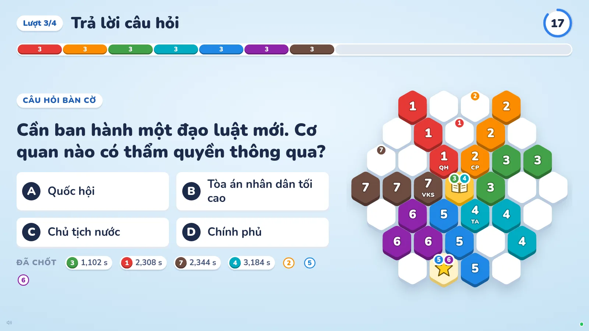
  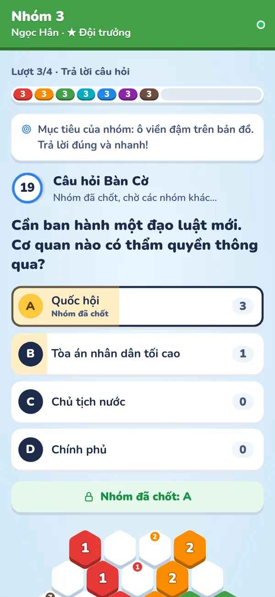
</p>

**③ Kết quả — 10 giây.** Ô đổi chủ, đáp án kèm giải thích (lúc học), và mỗi tranh chấp ghi rõ ai thắng, nhanh hơn bao nhiêu giây. Ở đây Nhóm 3 và Nhóm 4 cùng nhắm ô Hiến pháp và cùng trả lời đúng; Nhóm 3 chốt sớm hơn nên chiếm được ô và nhận **Khiên Hiến pháp**, còn nhóm trả lời sai thì tấn công thất bại.

<p align="center">
  
  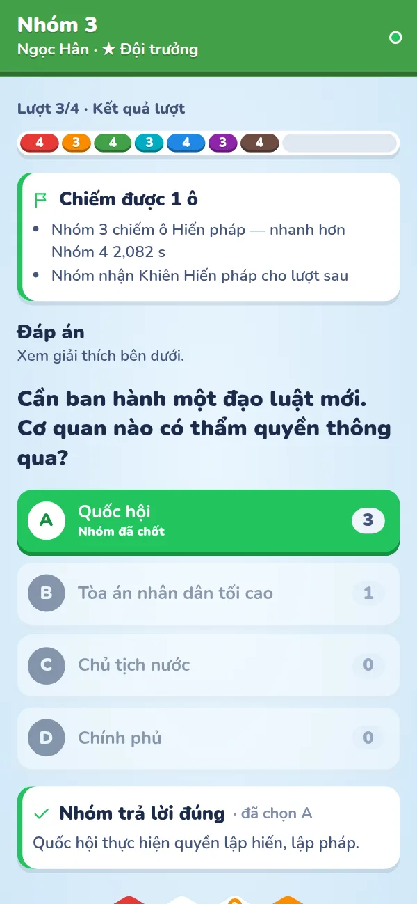
</p>

Lượt sau, ô của nhóm có khiên phát sáng viền vàng trên màn chiếu và không sáng lên là mục tiêu trên điện thoại các nhóm khác; điện thoại của nhóm có khiên được nhắc như ảnh dưới.

<p align="center">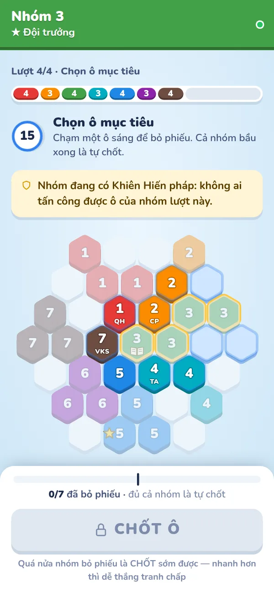</p>

### Quả Bom Tham Nhũng ([§4](docs/GAME_SPEC.md#4-quả-bom-tham-nhũng))
- Mặc định 3 quả, nổ lần lượt. Quả đầu tiên giao cho nhóm đang dẫn đầu.
- Mỗi quả có **ngòi bí mật 30–60 s**. Ngòi **chỉ cháy trong lúc nhóm cầm bom trả lời câu hỏi** (12 s/câu).
- Trả lời đúng: nhóm biểu quyết chuyền bom cho nhóm khác (PASS, 10 s), nhưng không được chuyền lại cho nhóm vừa chuyền cho mình. Trả lời sai: nhóm nhận câu mới và vẫn giữ bom.
- **Nổ**: nhóm đang cầm mất 2 ô ngẫu nhiên, và các ô đó thành ô trống.

<p align="center">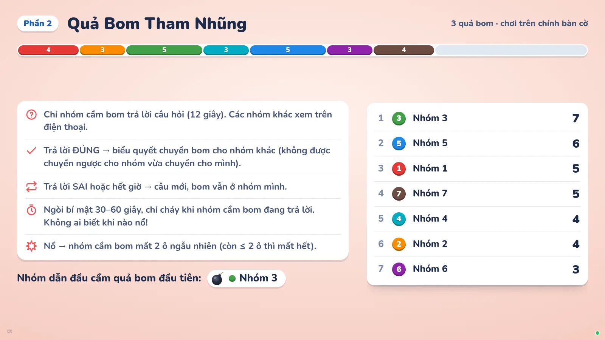</p>
<p align="center"><sub>Hết Bàn Cờ, màn chiếu chuyển sang tông đỏ: luật Quả Bom, bảng điểm và nhóm dẫn đầu cầm quả đầu tiên. Người dẫn bấm <b>Bắt đầu Quả Bom</b> khi lớp đã nắm luật.</sub></p>

**Cầm bom → trả lời (12 giây).** Chỉ nhóm cầm bom trả lời; điện thoại các nhóm khác chỉ xem. Ngòi chỉ cháy trong lúc này, nhưng không ai thấy còn bao lâu, kể cả người dẫn.

<p align="center">
  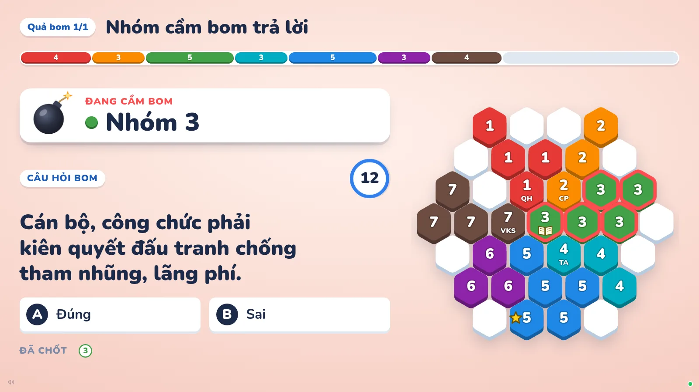
  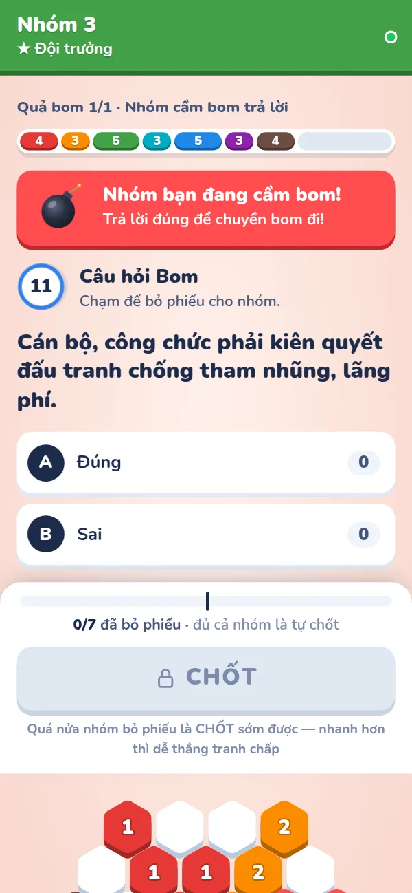
</p>

**Đúng → chuyền bom (10 giây).** Cả nhóm biểu quyết chọn nhóm nhận (ở đây 4/7 phiếu cho Nhóm 5). Không được chuyền ngược cho nhóm vừa chuyền cho mình: nhóm đó không có trong danh sách (ảnh dưới là lần chuyền đầu tiên nên cả 6 nhóm còn lại đều nhận được).

<p align="center">
  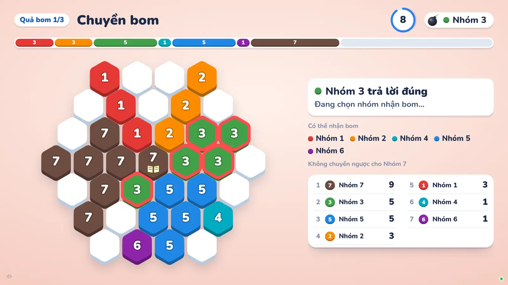
  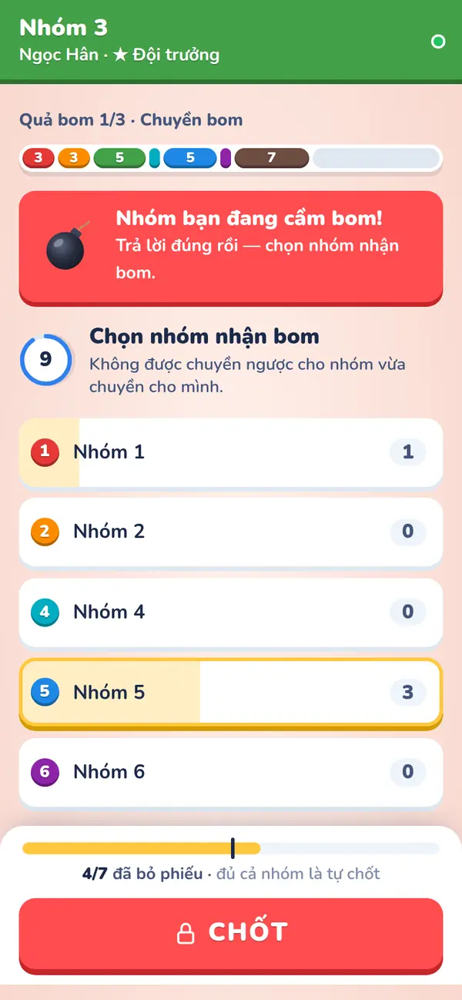
</p>

**Hết ngòi → BÙM!** Nhóm đang cầm mất 2 ô ngẫu nhiên (đánh dấu tia nổ). Quả kế tiếp giao cho nhóm dẫn đầu, trừ nhóm vừa bị nổ.

<p align="center">
  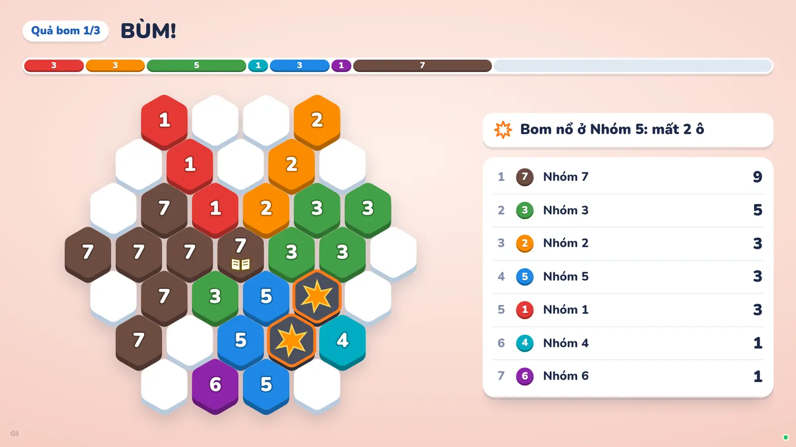
  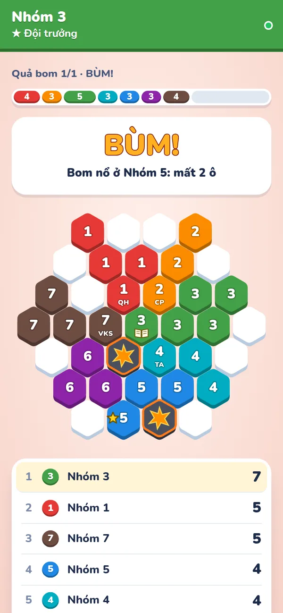
</p>

### Kết thúc trận ([§3.6](docs/GAME_SPEC.md#36-kết-thúc-và-tính-điểm))
Sau quả bom cuối: bục vinh danh, bảng xếp hạng đầy đủ (kèm số ô và số câu đúng để phân định khi bằng điểm) và nhật ký các vụ nổ; mỗi điện thoại hiện hạng của nhóm mình. Người dẫn bấm **Bước tiếp theo** để chuyển sang màn tổng kết 6 đặc điểm.

<p align="center">
  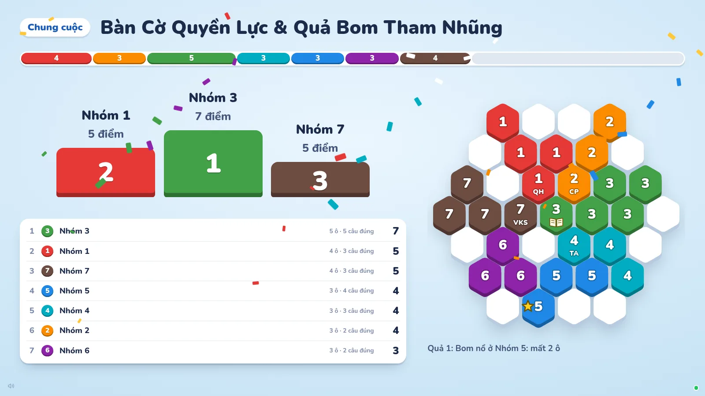
  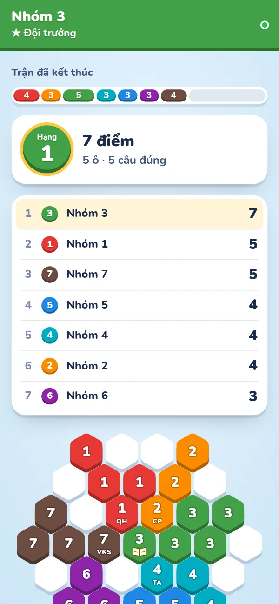
</p>
<p align="center">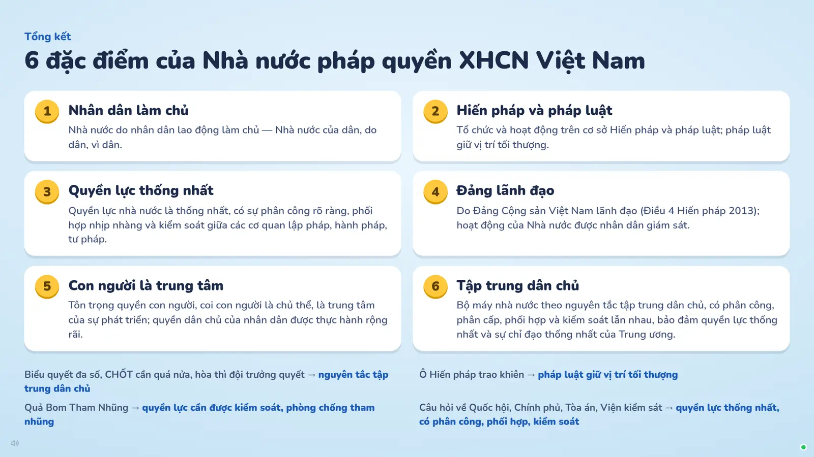</p>

### Ý nghĩa bài học ([CONTENT §6](docs/CONTENT.md))
- Biểu quyết đa số, chốt cần quá nửa: minh họa **tập trung dân chủ**.
- Ô Hiến pháp trao khiên: **pháp luật giữ vị trí tối thượng**.
- Quả bom tham nhũng: **quyền lực cần được kiểm soát**.

---

## 4. Kiến trúc

### Tổng quan
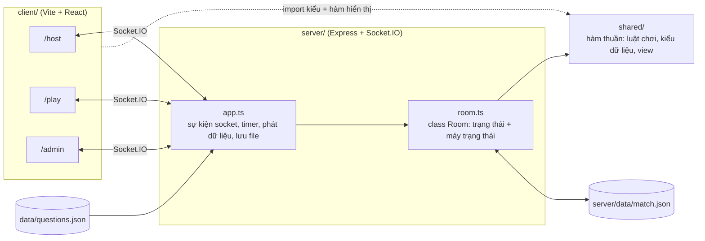
```mermaid
flowchart LR
  subgraph Client["client/ (Vite + React)"]
    H["/host"]
    P["/play"]
    A["/admin"]
  end
  subgraph Server["server/ (Express + Socket.IO)"]
    APP["app.ts<br/>sự kiện socket, timer, phát dữ liệu, lưu file"]
    ROOM["room.ts<br/>class Room: trạng thái + máy trạng thái"]
  end
  SHARED["shared/<br/>hàm thuần: luật chơi, kiểu dữ liệu, view"]
  Q[(data/questions.json)]
  F[(server/data/match.json)]
  H & P & A <-->|Socket.IO| APP
  APP --> ROOM --> SHARED
  Client -.->|import kiểu + hàm hiển thị| SHARED
  Q --> APP
  ROOM <--> F
```

Ba tầng, trách nhiệm rõ ràng:

| Tầng | Trách nhiệm | Không được làm |
|---|---|---|
| **`shared/`** | Toàn bộ luật chơi dưới dạng **hàm thuần**: nhận state cũ, trả state mới, không I/O, không `Date.now()` (thời gian và hàm ngẫu nhiên đều được truyền vào). Định nghĩa kiểu sự kiện Socket.IO và các hàm tạo "view" gửi xuống client. | Gọi socket, timer, đọc file |
| **`server/`** | `Room` giữ trạng thái và gọi hàm của `shared/` để chuyển pha. `app.ts` nhận sự kiện socket, đặt timer, phát dữ liệu cho đúng người, lưu file. | Tự viết luật chơi (luật phải nằm trong `shared/` để test được) |
| **`client/`** | Hiển thị và gửi thao tác. Mọi dữ liệu đều đến từ server. | Tự tính kết quả, giữ đồng hồ riêng, biết đáp án hay ngòi bom |

### Nguyên tắc bất di bất dịch (đọc kỹ trước khi sửa)
1. **Server là trọng tài duy nhất**: đồng hồ, đáp án, giải quyết tranh chấp, ngòi bom.
2. **KHÔNG BAO GIỜ gửi ngòi bom hay thời gian còn lại của bom xuống client**, kể cả gián tiếp. Ví dụ: không được làm hiệu ứng tích tắc nhanh dần theo thời gian còn lại. Client chỉ biết bom "đang cháy" hay "tạm dừng", và nhịp tích tắc luôn cố định 500 ms.
3. **Không gửi đáp án đúng trước khi câu hỏi đóng.**
4. "Nhanh hơn" = thời điểm **server** nhận lệnh CHỐT.
5. Logic game là hàm thuần trong `shared/` và **có unit test**.
6. Giao diện tiếng Việt có dấu. `/play` thiết kế cho điện thoại trước (nút cao ≥ 56 px), còn `/host` phải đọc được từ cuối lớp.
7. Chịu được mất kết nối: `playerId` lưu trong `localStorage`, vào lại vẫn giữ nhóm và vai trò.

Nguyên tắc 2 và 3 có test tự động canh giữ (xem [mục 7](#7-test)). Nếu một test này đỏ, **đừng sửa test cho xanh**: đó là lỗ hổng gian lận.

### Máy trạng thái (pha)
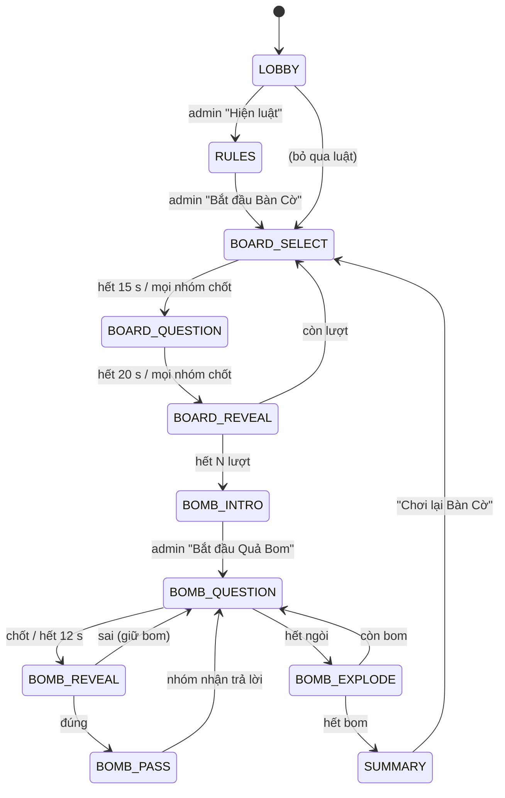
```mermaid
stateDiagram-v2
  [*] --> LOBBY
  LOBBY --> RULES: admin "Hiện luật"
  RULES --> BOARD_SELECT: admin "Bắt đầu Bàn Cờ"
  LOBBY --> BOARD_SELECT: (bỏ qua luật)
  BOARD_SELECT --> BOARD_QUESTION: hết 15 s / mọi nhóm chốt
  BOARD_QUESTION --> BOARD_REVEAL: hết 20 s / mọi nhóm chốt
  BOARD_REVEAL --> BOARD_SELECT: còn lượt
  BOARD_REVEAL --> BOMB_INTRO: hết N lượt
  BOMB_INTRO --> BOMB_QUESTION: admin "Bắt đầu Quả Bom"
  BOMB_QUESTION --> BOMB_REVEAL: chốt / hết 12 s
  BOMB_QUESTION --> BOMB_EXPLODE: hết ngòi
  BOMB_REVEAL --> BOMB_PASS: đúng
  BOMB_REVEAL --> BOMB_QUESTION: sai (giữ bom)
  BOMB_PASS --> BOMB_QUESTION: nhóm nhận trả lời
  BOMB_EXPLODE --> BOMB_QUESTION: còn bom
  BOMB_EXPLODE --> SUMMARY: hết bom
  SUMMARY --> BOARD_SELECT: "Chơi lại Bàn Cờ"
```
Tên pha nằm trong [shared/src/phases.ts](shared/src/phases.ts).

### Đồng hồ và timer: một timer cho mỗi phòng
Đây là điểm dễ sai nhất. Cách server điều khiển thời gian:
- `Room.nextDeadline()` trả về **thời điểm cần chuyển pha kế tiếp** (giờ server, đơn vị ms), hoặc `null` nếu phải chờ admin, đang tạm dừng hay đang ở chế độ dự phòng. Với `BOMB_QUESTION`, giá trị này bằng `min(hạn câu hỏi, hạn ngòi)`. Vì vậy nó **chỉ được dùng trong server**.
- `app.ts` → `arm(room)` đặt **đúng một** `setTimeout` tại mốc đó. Khi timer chạy, nó gọi `room.advance()`, rồi `changed(room)`.
- `changed(room)` = phát lại state cho mọi người, gửi nhật ký cho admin, lưu file (gộp các lần ghi trong 250 ms), rồi gọi `arm` lần nữa.
- **Tạm dừng** không hủy timer theo kiểu thủ công. Lúc tiếp tục, server **dời mọi mốc thời gian** (hạn pha, thời điểm chốt, ngòi) đúng bằng khoảng đã dừng, nên thứ tự chốt được giữ nguyên.
- Client chỉ *hiển thị* đếm ngược từ `endsAt`, có bù lệch đồng hồ đo bằng `client:ping` ([client/src/clock.ts](client/src/clock.ts)). Client không bao giờ tự quyết khi nào hết giờ.

Quy tắc khi sửa: **thêm pha có đồng hồ thì phải cập nhật cả `nextDeadline()` lẫn `advance()`** trong [server/src/room.ts](server/src/room.ts).

### Luồng dữ liệu Socket.IO
Tất cả sự kiện có kiểu chặt chẽ, khai báo ở [shared/src/events.ts](shared/src/events.ts). Lệnh từ client đều dùng **ack** dạng `{ ok: true, ... } | { ok: false, error }`.

| Server → client | Gửi cho ai | Nội dung |
|---|---|---|
| `room:state` | cả phòng | Người chơi, nhóm, đội trưởng, online |
| `game:state` | cả phòng | Pha, bàn cờ, điểm, khiên, trạng thái bom công khai (`GameView`) |
| `question:state` | cả phòng | Câu hỏi. **Khi câu còn mở thì không có đáp án.** |
| `question:team` / `select:team` / `pass:team` | **chỉ thành viên nhóm đó** | Số phiếu trực tiếp của nhóm mình, kèm việc nút CHỐT đã bật chưa |
| `admin:log` | chỉ admin đã đăng nhập | Nhật ký sự kiện |
| `room:created` | các host đang chờ | Admin vừa tạo phòng mới |

Lệnh từ client:
- Người chơi: `player:join`, `player:vote`, `player:lock`, `player:changeTeam`
- Màn chiếu: `host:watch`
- Người dẫn: `admin:*`, tức khoảng 20 lệnh (xem `events.ts`)

Mỗi phòng có một channel `room:<code>`, còn admin có thêm channel riêng `admin:<code>`.

**Mẫu "view"**: server không bao giờ gửi nguyên object trạng thái nội bộ (ví dụ `BombGame` có chứa ngòi). Mỗi loại dữ liệu có một hàm tạo view trong `shared/` chọn lọc trường được phép gửi: `publicQuestionView`, `teamQuestionView`, `publicBoardView`, `publicBombView`… Muốn gửi thêm thông tin xuống client thì **sửa hàm view**, đừng gửi thẳng state.

### Lưu và khôi phục trận
- Sau mỗi thay đổi, `Room.toSnapshot()` được ghi vào `server/data/match.json` (ghi nguyên tử: ghi file tạm rồi đổi tên). File này **có ngòi bom**, nên không bao giờ được gửi xuống client, và đã nằm trong `.gitignore`.
- Lúc khởi động, nếu file còn mới hơn 3 giờ thì `Room.fromSnapshot()` khôi phục trận, đặt ở trạng thái **tạm dừng**.
- Nhận `SIGTERM`/`SIGINT` thì `flush()` ghi file ngay rồi mới thoát.
- **Thêm trường vào `Room` thì nhớ thêm vào `RoomSnapshot`, `toSnapshot()` và `fromSnapshot()`.** Nếu đổi định dạng theo kiểu không tương thích, hãy tăng `version` (hiện là `1`) để file cũ bị bỏ qua thay vì khôi phục sai.

---

## 5. Bản đồ codebase

```
.
├── shared/src/          Luật chơi (hàm thuần) + kiểu dữ liệu — import qua "@cnxh/shared"
├── server/src/          Room (máy trạng thái), app.ts (Socket.IO, timer), lưu file
├── client/src/          React: pages/ (3 màn hình) + component + styles/
├── scripts/             simulate.ts (giả lập tải), screenshots.ts (chụp ảnh README), claude-session-start.sh
├── data/questions.json  Ngân hàng câu hỏi
├── docs/                GAME_SPEC (luật), ROADMAP, CONTENT (kiến thức), DEPLOY
├── CLAUDE.md            Hướng dẫn cho Claude Code (cũng hữu ích cho người)
├── render.yaml          Cấu hình deploy Render Blueprint
└── .github/workflows/   CI: typecheck + test + build + simulate
```

### `shared/src/`: luật chơi
Xuất qua [index.ts](shared/src/index.ts). Mỗi module đi kèm một file `*.test.ts` cùng tên.

| File | Nội dung | Spec |
|---|---|---|
| [phases.ts](shared/src/phases.ts) | Danh sách pha, `isPhase` | §6 |
| [events.ts](shared/src/events.ts) | **Hợp đồng Socket.IO**: mọi sự kiện, payload, mã lỗi, `LogEntry` | |
| [lobby.ts](shared/src/lobby.ts) | Hằng số 7 nhóm, mã phòng 4 số, chuẩn hóa tên, kiểu `RoomState` | §2.1 |
| [captain.ts](shared/src/captain.ts) | Chọn đội trưởng, chuyển quyền tạm sau 10 s mất kết nối | §2.1 |
| [stars.ts](shared/src/stars.ts) | ★ Lòng dân: lượt có sao (`isStarTurn`), chọn ô cho sao (`pickStarCell`: tránh nhóm dẫn đầu, ưu tiên ô ≥ 2 nhóm tới được) | §3.7 |
| [roster.ts](shared/src/roster.ts) | Danh sách nhóm trưởng thực tế: khớp tên có/không dấu, gõ tắt, tên bị cắt ở 20 ký tự (`matchName`, `findRosterCaptain`), tình trạng từng nhóm (`rosterStatus`, `rosterChanges`), đọc danh sách dán từ Excel (`parseRosterText`) | §2.1 |
| [voting.ts](shared/src/voting.ts) | Đếm phiếu, `canLock` (quá nửa), `resolveTeamChoice` (đa số / đội trưởng / sớm nhất) | §2.2 |
| [voteRound.ts](shared/src/voteRound.ts) | **Vòng biểu quyết dùng chung** cho câu hỏi, SELECT, PASS: bỏ phiếu, chốt, tự chốt khi cả nhóm đã bầu (test: `autoLock.test.ts`), đóng, tự chốt khi hết giờ, dời mốc khi tạm dừng, nhập tay (dự phòng) | §2.2 |
| [questions.ts](shared/src/questions.ts) | Kiểu `Question`, kiểm tra ngân hàng câu hỏi, trộn phương án, chọn câu không lặp | §2.3 |
| [questionRound.ts](shared/src/questionRound.ts) | Vòng câu hỏi (dựa trên `voteRound`) + view công khai / view của nhóm | §2.3–2.4 |
| [clock.ts](shared/src/clock.ts) | Ước lượng lệch đồng hồ client–server, số giây còn lại | §2.4 |
| [board.ts](shared/src/board.ts) | Lưới lục giác 37 ô, ô kề, vòng ngoài, ô xuất phát, ô Hiến pháp, 4 ô Cơ quan (`ORGANS`), `validTargets`, `cellPoints`/`scoreOf` | §3.1, §3.7 |
| [selectRound.ts](shared/src/selectRound.ts) | Vòng SELECT chọn ô mục tiêu; mục tiêu chỉ lộ khi đóng | §3.2 |
| [resolveTurn.ts](shared/src/resolveTurn.ts) | **Giải quyết một lượt**: tranh chấp, phòng thủ, khiên. Có 47 test. | §3.3–3.5 |
| [standings.ts](shared/src/standings.ts) | Thống kê câu đúng / thời gian chốt, xếp hạng với tiêu chí phụ | §3.6 |
| [boardMatch.ts](shared/src/boardMatch.ts) | Trận Bàn Cờ (lượt, số lượt N), `GameView` gửi client | §3 |
| [bomb.ts](shared/src/bomb.ts) | Ngòi (chỉ server), ai cầm bom đầu, nhóm được nhận, nổ, vòng PASS, `publicBombView` | §4 |
| [fallback.ts](shared/src/fallback.ts) | Chế độ dự phòng: đổi hạng thành thời điểm chốt (hạng × 1 s) | §5.3 |
| [describe.ts](shared/src/describe.ts) | Câu chữ tiếng Việt cho nhật ký (kết quả ô, nổ, khiên) | §5.3 |
| [boardFixtures.ts](shared/src/boardFixtures.ts) | Tiện ích cho test: `c(q, r)` (id của ô), `mk([...])` (dựng bàn cờ) | |

### `server/src/`
| File | Nội dung |
|---|---|
| [index.ts](server/src/index.ts) | Điểm vào: đọc biến môi trường, `listen`, ghi file khi tắt |
| [app.ts](server/src/app.ts) | `createAppServer()`: Express (`/api/health`, phục vụ `client/dist` ở production), **toàn bộ handler Socket.IO**, timer, phát dữ liệu, lưu file. Nhận option `timing` và `questions` để test chạy nhanh. |
| [room.ts](server/src/room.ts) | `class Room`: người chơi, đội trưởng, pha, câu hỏi, Bàn Cờ, Quả Bom, tạm dừng, dự phòng, nhật ký, snapshot. `class RoomRegistry`: danh sách phòng. Đồng hồ `now()` được **tiêm vào** để test điều khiển thời gian. |
| [persistence.ts](server/src/persistence.ts) | Đọc/ghi snapshot, giới hạn 3 giờ |
| [questionBank.ts](server/src/questionBank.ts) | Đọc và kiểm tra `data/questions.json`. File lỗi thì server **dừng ngay**, để phát hiện trước buổi học. |

### `client/src/`
Không dùng router: [App.tsx](client/src/App.tsx) chọn trang theo `location.pathname`.

| Nhóm | File |
|---|---|
| Trang | [pages/HostPage.tsx](client/src/pages/HostPage.tsx), [pages/PlayPage.tsx](client/src/pages/PlayPage.tsx), [pages/AdminPage.tsx](client/src/pages/AdminPage.tsx), [pages/HomePage.tsx](client/src/pages/HomePage.tsx) |
| Kết nối | [socket.ts](client/src/socket.ts): **một** socket cho cả trang + các hook `useRoomState`, `useGame`, `useQuestion`, `useTeamVotes`, `useTeamSelect`, `useTeamPass`, `useAdminLog`. [clock.ts](client/src/clock.ts): bù lệch đồng hồ, `useCountdown`. |
| Màn chiếu | `HostGame`, `HostBomb`, `HostRules`, `HostLessons`, `HostParts`, `Standings`, `TerritoryBar`, `Confetti`, `QuestionPanel` |
| Điện thoại | `PlayBoard` (chọn ô), `PlayQuestion` + `VoteControls` (biểu quyết, nút CHỐT), `PlayBomb` |
| Người dẫn | `AdminNext` (thanh tiến trình + nút **Bước tiếp theo**), `AdminBoard`, `AdminPlayers` (người chơi dạng chip, ô ★ đội trưởng từng nhóm), `AdminRoster` (danh sách nhóm trưởng thực tế lưu `localStorage`, nút **Đặt theo danh sách**), `AdminFallback`, `AdminLog` |
| Điều khiển | [nextStep.ts](client/src/nextStep.ts): **một nguồn duy nhất** cho "bước tiếp theo" ở mỗi pha — dùng chung cho `/admin` và phím tắt trên `/host` ([HostRemote.tsx](client/src/HostRemote.tsx)). Thêm pha mới cần người dẫn bấm → sửa ở đây. |
| Dùng chung | `HexBoard` (vẽ bàn cờ SVG), `Countdown`, `Outcome`, `TeamTag`, `StatusBanner`, `ConnectionBadge`, `Icon` (bộ icon nét thay cho emoji), `Logo`, `BombIcon` |
| Âm thanh | [sound.ts](client/src/sound.ts): tạo âm bằng Web Audio API (không cần file âm thanh), **chỉ phát trên host**. [useHostSounds.ts](client/src/useHostSounds.ts) quyết định lúc nào phát âm nào. |
| Nội dung | [rules.ts](client/src/rules.ts) (luật tóm tắt), [lessons.ts](client/src/lessons.ts) (6 đặc điểm, lấy từ CONTENT.md), [boardText.ts](client/src/boardText.ts) (nhãn pha), [teams.ts](client/src/teams.ts) (màu nhóm) |
| Giao diện | `styles/`: `base.css` (biến màu, phông), `components.css`, `board.css`, `host.css`, `play.css`, `admin.css` |

**Phong cách giao diện**: kiểu game chiếm lãnh thổ di động (State.io/Risk), gồm nền "biển" sáng, thẻ trắng, nút và ô lục giác nổi khối. Màu nhóm được truyền qua biến CSS `--team` / `--team-dark` bằng hàm `teamStyle(teamId)`. Màn chiếu tính mọi kích thước theo biến `--u` (1% chiều rộng, giới hạn theo tỉ lệ 16:9) nên vừa khít mọi độ phân giải. Phông Nunito tự host (`@fontsource-variable/nunito`), không cần mạng ngoài.

---

## 6. Hướng dẫn sửa đổi thường gặp

### Thêm hoặc sửa câu hỏi
Sửa [data/questions.json](data/questions.json). Đọc quy tắc soạn câu ở [docs/CONTENT.md §5](docs/CONTENT.md) trước khi viết.
```json
{
  "id": "b19", "pool": "board", "topic": "dac-diem", "type": "mcq",
  "prompt": "Câu hỏi ≤ 25 từ?",
  "options": ["Đáp án đúng", "Nhiễu 1", "Nhiễu 2", "Nhiễu 3"],
  "answerIndex": 0,
  "explanation": "1–2 câu, nêu căn cứ (giáo trình hoặc điều Hiến pháp).",
  "source": "Hiến pháp 2013, Điều 2"
}
```
- `pool: "board"` cần đúng **4** phương án. `pool: "bomb"` cần 2–3 phương án.
- `type: "tf"` (đúng/sai) phải có `options` đúng bằng `["Đúng", "Sai"]`.
- `answerIndex` đánh số từ 0. Không cần tự trộn thứ tự: server trộn phương án mỗi lần hỏi.
- `id` không được trùng. `topic` thuộc `nguon-goc | ban-chat | chuc-nang | bo-may | dac-diem | tinh-huong`.
- Chạy `npm test`: test `questionBank.test.ts` kiểm tra file hợp lệ và các quy tắc đo được ở [CONTENT §5](docs/CONTENT.md) (đủ số câu, số từ, `topic`, có `source`, không trùng câu). Server cũng từ chối khởi động nếu file sai định dạng.
- **Tự đối chiếu đáp án với giáo trình** trước buổi học.

### Đổi luật chơi
1. Cập nhật [docs/GAME_SPEC.md](docs/GAME_SPEC.md) **trước**, và thêm một dòng vào mục **7. Nhật ký quyết định** giải thích lý do.
2. Viết hoặc sửa test trong `shared/src/*.test.ts`, cho test đỏ trước.
3. Sửa hàm thuần trong `shared/` cho test xanh.
4. Nếu cần, sửa `Room` (server) và giao diện.
5. Chạy `npm test && npm run typecheck`.

### Chỉnh thời lượng các pha
Các hằng số nằm trong `shared/`:

| Pha | Hằng số | Mặc định |
|---|---|---|
| SELECT | `SELECT_DURATION_MS` | 15 s |
| Câu Bàn Cờ / câu bom | `QUESTION_DURATION_MS` | 20 s / 12 s |
| REVEAL Bàn Cờ | `BOARD_REVEAL_MS` | 10 s |
| Bom: REVEAL / PASS / nổ | `BOMB_REVEAL_MS` / `BOMB_PASS_MS` / `BOMB_EXPLODE_MS` | 8 / 10 / 6 s |
| Ngòi bom | `FUSE_MIN_MS`–`FUSE_MAX_MS` | 30–60 s |
| Số lượt / số bom | `DEFAULT_BOARD_TURNS` / `DEFAULT_BOMB_COUNT` | 14 / 3 (admin chỉnh được khi chơi) |

Server gom các hằng số này thành `DEFAULT_TIMING` trong `room.ts`. Test truyền `timing` ngắn hơn qua `createAppServer({ timing })`.

### Thêm một lệnh mới từ client (ví dụ một nút admin)
1. **Khai báo kiểu** trong [shared/src/events.ts](shared/src/events.ts) (`ClientToServerEvents`), kèm `ack: (res: Ack) => void`.
2. **Logic**: nếu có luật thì viết hàm thuần trong `shared/` (kèm test), rồi viết method trong `Room` trả về `RoomResult`. Method phải **tự kiểm tra input**, vì client có thể gửi bất cứ thứ gì (`unknown`).
3. **Handler** trong [server/src/app.ts](server/src/app.ts). Với lệnh admin làm đổi trạng thái trận, chỉ cần một dòng:
   ```ts
   socket.on('admin:myAction', (req, ack) => adminAction(ack, (room) => room.myAction(req?.value)));
   ```
   `adminAction` lo kiểm tra đăng nhập, chạy lệnh, rồi gọi `changed(room)` (phát lại + lưu + đặt lại timer).
4. **Client**: `socket.emit('admin:myAction', {...}, (res) => ...)`. Dữ liệu cập nhật tự đổ về qua các hook trong `socket.ts`.
5. **Test** trong `server/src/*.test.ts`. Ưu tiên test `Room` trực tiếp (nhanh); chỉ dùng socket thật khi cần kiểm tra ai nhận được gì.

### Gửi thêm dữ liệu xuống client
Sửa **hàm view** tương ứng trong `shared/` (ví dụ `publicBoardView`, `publicBombView`) và kiểu dữ liệu của nó. Đừng thêm `io.emit` gửi thẳng object nội bộ. Nếu dữ liệu có thể làm lộ đáp án hoặc ngòi, hãy chạy lại các test bảo mật ở mục 7.

### Sửa giao diện
- Màu và token chung ở `client/src/styles/base.css`. Mỗi màn hình có file CSS riêng.
- Màn chiếu: dùng đơn vị `calc(var(--u) * …)` thay cho `px`, để hiển thị đúng trên mọi máy chiếu.
- Điện thoại: nút cao ≥ 56 px, thử ở chiều rộng khoảng 360 px.
- Mọi chữ hiển thị đều bằng **tiếng Việt có dấu**. Tên biến, hàm, file bằng tiếng Anh.
- Bàn cờ (`HexBoard`, SVG 37 ô): **đừng đặt `opacity` cho cả nhóm `<g>` của từng ô, và đừng cho hoạt ảnh lặp vô hạn trên nhiều ô cùng lúc**. Trên Chrome Android, bàn cờ sẽ bị vẽ vỡ thành sọc, mép các ô chồng nhau lộ dải sáng tối. Muốn làm mờ ô thì dùng lớp phủ `.hex__dim` (xem comment trong `board.css`).
- Ảnh minh họa trong file này nằm ở `docs/images/` (WebP, chụp từ app thật). Đổi giao diện thì chạy `npm run screenshots` để chụp lại (xem mục ngay dưới).

### Chụp lại ảnh README (`npm run screenshots`)
[scripts/screenshots.ts](scripts/screenshots.ts) chạy server riêng trong tiến trình, cho 49 người chơi giả lập chơi một trận theo kịch bản cố định (4 lượt Bàn Cờ, 1 quả bom), mở `/host`, `/admin` và một điện thoại bằng Chrome headless, rồi chụp đủ 27 ảnh mà README dùng. Mất khoảng 2–3 phút.
```bash
npm run screenshots                        # build client rồi ghi đè docs/images/*.webp
npm run screenshots -- --out /tmp/anh      # ghi ra thư mục khác để xem trước
npm run screenshots -- --no-build          # bỏ bước build khi client/dist đã mới
npm run screenshots -- --chrome /usr/bin/chromium   # chỉ đường dẫn Chrome (hoặc đặt biến CHROME_PATH)
```
- Cần **Node ≥ 22** (script dùng WebSocket có sẵn của Node) và **Google Chrome hoặc Chromium** đã cài trên máy. Không cần thêm thư viện nào.
- Kịch bản cố định để khớp chú thích ở [mục 3](#3-luật-chơi-và-cách-chơi): điện thoại là của "Ngọc Hân" (đội trưởng Nhóm 3); lượt 3 Nhóm 3 chiếm ô Hiến pháp, nhanh hơn Nhóm 4; Nhóm 3 cầm bom đầu và chuyền cho Nhóm 5; ngòi đặt cố định 4 giây nên bom nổ ở Nhóm 5. Câu hỏi, vị trí ★ và ô bị nổ thì ngẫu nhiên, nên chú thích không nhắc tới. Sửa kịch bản thì sửa luôn chú thích tương ứng.
- QR trong ảnh màn chiếu trỏ tới bản web thật (`cnxh-game.onrender.com/play`).
- Xem lại vài ảnh trước khi commit. Nếu giao diện đổi tới mức script không tìm thấy phần tử cần bấm, script dừng với mã 1 và báo bước bị kẹt; ảnh đã chụp trước bước đó vẫn bị ghi đè, muốn bỏ thì chạy `git checkout docs/images`.

---

## 7. Test

```bash
npm test                 # toàn bộ: 27 file, 310 test (khoảng 12 giây)
npm run test:watch       # chạy lại khi lưu file
npx vitest run resolveTurn    # chỉ chạy file khớp tên
```
Vitest chạy `shared/src/**/*.test.ts` và `server/src/**/*.test.ts`. Client chưa có test giao diện.

| Loại | File | Cách viết |
|---|---|---|
| Luật thuần | `shared/src/*.test.ts` | Gọi hàm trực tiếp. Dùng `c(q, r)` / `mk(...)` trong `boardFixtures.ts` để dựng bàn cờ. Truyền `now` và `rng` cố định. |
| `Room` | `server/src/{room,board,bomb,admin}.test.ts` | Tạo `Room` với **đồng hồ giả** (biến `now` tự tăng), gọi method rồi kiểm tra state. Không cần chờ thật. |
| Socket thật | `server/src/{app,question,boardSocket,bombSocket,restart}.test.ts` | `createAppServer({ timing: ngắn, questions, adminPassword })` trên cổng ngẫu nhiên, kết nối bằng `socket.io-client`. |

**Test bảo mật bắt buộc** (không được xóa hay nới lỏng):
- `question.test.ts`: *"không payload nào (host, admin, người chơi, ack) chứa đáp án đúng khi câu còn mở"*
- `bombSocket.test.ts`: *"không payload/ack nào chứa ngòi"*
- `bomb.test.ts`: *"hai phòng chỉ khác độ dài ngòi: mọi dữ liệu gửi client giống hệt nhau cho tới khi nổ"*. Test này bắt cả rò rỉ **gián tiếp**.
- `boardSocket.test.ts`: SELECT không lộ mục tiêu trước khi đóng.

### Giả lập tải (`npm run simulate`)
[scripts/simulate.ts](scripts/simulate.ts) tạo 63 bot (7 nhóm × 9 người) bỏ phiếu ngẫu nhiên, bot đội trưởng CHỐT ở thời điểm ngẫu nhiên, và chơi trọn Bàn Cờ, Quả Bom rồi SUMMARY.
```bash
npm run simulate                                   # server trong tiến trình, thời lượng rút ngắn (~2,5 phút)
npm run simulate -- --turns 3 --bombs 1            # nhanh hơn
npm run simulate -- --url https://<app>.onrender.com --password <ADMIN_PASSWORD> --real   # thử tải bản deploy
```
Kết quả đúng là dòng `OK — trận chạy trọn vẹn, không lỗi`; nếu có lỗi thì script thoát với mã 1. CI chạy bản rút gọn `--turns 2 --bombs 1`.

### CI
[.github/workflows/ci.yml](.github/workflows/ci.yml) chạy cho mỗi push lên `main` và mỗi PR: `npm ci` → typecheck → test → build client → simulate rút gọn. **PR phải xanh mới merge.**

---

## 8. Deploy

Một service duy nhất trên **Render** (hoặc Railway): server Node phục vụ cả Socket.IO lẫn bản build của client. **Không dùng Vercel/Netlify**, vì chúng không giữ được WebSocket lâu dài.

Bản đang chạy: **https://cnxh-game.onrender.com/** (tự deploy lại mỗi khi `main` có commit mới). Cách dùng cho người tổ chức buổi chơi: [mục 1, Cách 1](#cách-1--dùng-bản-web-trên-render-không-cần-cài-gì).

Tạo một bản deploy mới (ví dụ cho lớp khác) chỉ cần vài cú click: mở [render.com/deploy?repo=https://github.com/leonardotrong/CNXH_GAME_4](https://render.com/deploy?repo=https://github.com/leonardotrong/CNXH_GAME_4) (hoặc Render → **New → Blueprint** → chọn repo này). Render sẽ đọc [render.yaml](render.yaml); nhập `ADMIN_PASSWORD` khi được hỏi.

Những điều cần nhớ:
- Chỉ chạy **1 instance**, vì trạng thái trận nằm trong bộ nhớ của một tiến trình.
- Gói miễn phí "ngủ" sau khoảng 15 phút không có truy cập, nên **mở `/host` trước giờ học 15 phút**.
- **Không deploy trong giờ học**: deploy lại sẽ xóa file trạng thái trên gói miễn phí.
- Có phương án chạy trên **mạng LAN** (không cần Internet) và phương án chơi bằng **thẻ màu** khi mọi mạng đều hỏng.

Hướng dẫn chi tiết, bảng cấu hình thủ công và checklist kiểm tra sau deploy nằm ở [docs/DEPLOY.md](docs/DEPLOY.md).

---

## 9. Quy ước làm việc và Claude Code

### Quy ước
- **Ngôn ngữ**: giao diện, comment, tài liệu, commit message bằng tiếng Việt. Tên biến, hàm, file bằng tiếng Anh.
- **Đổi luật**: sửa `docs/GAME_SPEC.md` (kèm Nhật ký quyết định) **trước**, sau đó mới sửa code.
- **Mỗi thay đổi**: viết hoặc cập nhật test → cài đặt → `npm test` + `npm run typecheck` → commit.
- **Thư viện**: hỏi cả nhóm trước khi thêm thư viện lớn hoặc đổi stack. Hiện tại client chỉ dùng `react`, `socket.io-client`, `qrcode` và phông chữ.
- **Nhánh**: làm trên nhánh riêng rồi mở PR vào `main`; CI phải xanh.

### Stack
| | |
|---|---|
| Ngôn ngữ | TypeScript 7 (strict), ESM |
| Server | Node + Express 5 + Socket.IO 4, chạy bằng `tsx` cả ở dev lẫn production (không có bước biên dịch server) |
| Client | React 19 + Vite 8 |
| Test | Vitest 5 |
| Monorepo | npm workspaces. `shared/` xuất thẳng mã TS (`@cnxh/shared` → `shared/src/index.ts`), không cần build riêng. |

### Làm việc với Claude Code
- [CLAUDE.md](CLAUDE.md) là "trí nhớ" của dự án cho Claude Code: nguyên tắc, lệnh, trạng thái các giai đoạn. Claude đọc file này mỗi phiên, nên **hãy cập nhật nó** khi đổi lệnh hoặc kiến trúc.
- [docs/ROADMAP.md](docs/ROADMAP.md) liệt kê các giai đoạn đã làm, kèm prompt mẫu và tiêu chí hoàn thành.
- **Claude Code trên web** (claude.ai/code): hook `SessionStart` ([.claude/settings.json](.claude/settings.json) → [scripts/claude-session-start.sh](scripts/claude-session-start.sh)) tự chạy `npm ci` khi phiên chạy trên cloud; ở máy local thì hook bỏ qua. Để dùng được, mỗi người cần kết nối GitHub và cài Claude GitHub App cho repo này.

---

## 10. Việc còn dở và vấn đề đã biết

- [ ] **Giảng viên duyệt ngân hàng câu hỏi.** Đã đủ số lượng (**26 câu `board` + 36 câu `bomb`**, rà soát với giáo trình và Hiến pháp 2013 vào 10/2026), nhưng nên nhờ giảng viên đối chiếu với slide đang dùng trước buổi học ([CONTENT §5](docs/CONTENT.md)).
- [ ] **Giai đoạn 7**: đã deploy lên Render (https://cnxh-game.onrender.com/); còn thử với ≥ 10 điện thoại dùng 4G.
- [ ] Phiên bản Node chưa thống nhất: `render.yaml` và `docs/DEPLOY.md` đặt `NODE_VERSION=22`, còn `.nvmrc` (local và CI) là 24. Cả hai đều chạy được, nhưng nên thống nhất.
- [ ] Client chưa có test giao diện (chỉ kiểm thử thủ công và bằng `simulate`).

---

## 11. Xử lý sự cố

| Triệu chứng | Nguyên nhân / cách xử lý |
|---|---|
| `Cannot find module 'qrcode'` (hoặc module khác) sau khi `git pull` | Có người vừa thêm thư viện. Chạy `npm ci`. |
| Không đăng nhập được `/admin` | Chưa đặt `ADMIN_PASSWORD` khi chạy server. |
| Điện thoại quét QR nhưng không vào được | QR đang trỏ `localhost`. Đặt `PUBLIC_URL=http://<IP-LAN>:5173` (dev) hoặc `:3000` (production), và kiểm tra điện thoại có cùng wifi không (một số wifi trường chặn thiết bị nói chuyện với nhau). |
| Server không khởi động, báo "Ngân hàng câu hỏi … có lỗi" | `data/questions.json` sai định dạng. Thông báo chỉ ra câu nào sai. |
| Khởi động lại thấy trận cũ hiện lên ở trạng thái tạm dừng | Đây là tính năng khôi phục. Muốn bỏ trận cũ: bấm **Tạo phòng mới** trên `/admin`, hoặc xóa `server/data/match.json`, hoặc chạy với `STATE_FILE=`. |
| `npm warn allow-scripts … esbuild` khi cài | Vô hại: esbuild dùng gói nhị phân theo nền tảng, nên vẫn chạy được. |
| Đồng hồ trên các điện thoại lệch nhau | Client đo lệch đồng hồ lại mỗi lần kết nối. Bảo người chơi tải lại trang; nếu vẫn lệch thì xem `client/src/clock.ts`. |
